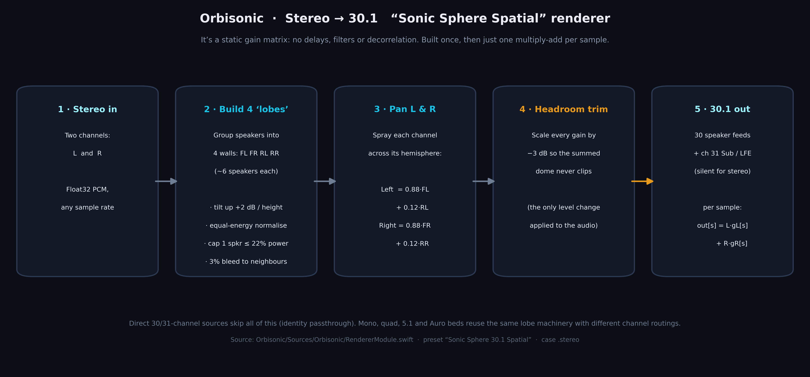
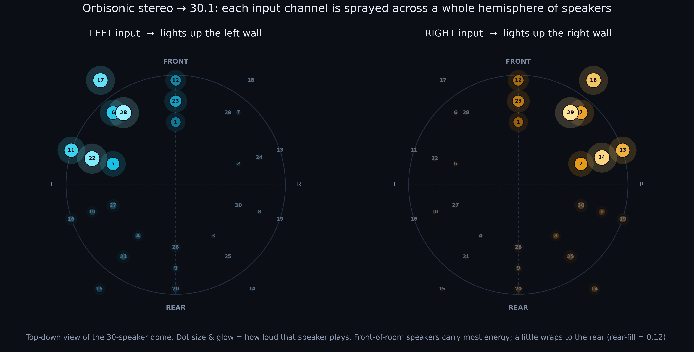
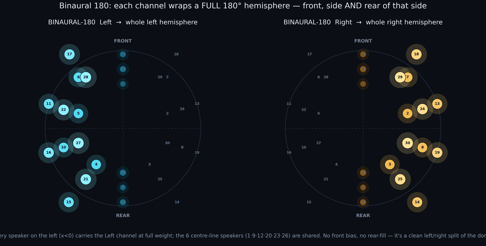

# Stereo → 30.1: how the Sonic Sphere renderer works

*Source: [`Sources/Orbisonic/RendererModule.swift`](../../Sources/Orbisonic/RendererModule.swift) — class `FeyStaticBedRenderer`, preset **“Sonic Sphere 30.1 Spatial.”***

Orbisonic plays ordinary **stereo** (and mono, quad, 5.1, and Auro beds) over the 30‑speaker
Sonic Sphere plus a sub — the *“.1.”* It does **not** simply send Left to one speaker and Right
to another. Each input channel is spread across a whole region of the dome using a fixed
**gain matrix** that is built once and then applied with a single multiply‑add per sample.
There are no delays, filters, or decorrelation — the code calls it a *static bed*.

## The pipeline

1. **Stereo in** — two channels, Float32 PCM, any sample rate.
2. **Build four “lobes.”** Group the speakers into front‑left / front‑right / rear‑left /
   rear‑right “walls” (~6 speakers each). Each lobe is tilted up (+2 dB per unit of height),
   power‑normalised so the whole wall carries equal energy, capped so no single speaker
   exceeds 22 % of the lobe’s power, and bled 3 % into its neighbours so the walls blend.
3. **Pan L & R onto the lobes:** `Left = 0.88·FL + 0.12·RL`, `Right = 0.88·FR + 0.12·RR`.
   The 12 % “rear‑fill” wraps each side slightly toward the back.
4. **−3 dB trim** so the summed dome can’t clip — the only level change applied to the audio.
5. **30.1 out** — 30 speaker feeds plus channel 31 (sub/LFE, silent for plain stereo).
   Per sample: `out[s] = L·gL[s] + R·gR[s]`.

Direct 30/31‑channel sources skip all of this (identity pass‑through).

## Where Left and Right land — Stereo 90

The **Left** channel lights up the left wall of the dome (loudest on the upper‑front‑left
speakers) and **Right** the right wall. The three dead‑ahead speakers are shared between the
two, which produces a natural phantom centre for centred vocals.

## The other two‑channel mode — Binaural 180

A stereo source can instead be rendered as **Binaural 180** (`case .binaural` →
`buildHemisphereVector`). Rather than a front‑biased wall, each channel is sprayed across the
**entire hemisphere** on its side — front *and* rear equally — with the six centre‑line
speakers shared. This preserves the front/back and height cues that are already encoded in
binaural / HRTF material instead of pulling everything to the front.

---

*The diagrams above are generated from the renderer’s actual computed gains, not mock‑ups.*
